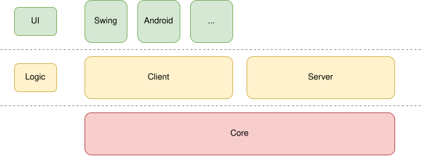

# Personal Music Platform

A platform and music player to synchronize libraries and control playback across devices.

> The project is currently in pre-alpha. It has been in daily use for months, but it still requires a lot of work to be done to be ready for public use.

# Structure

The project is divided using Gradle subprojects across 3 layers:
1. **Core**: Defines the network protocol and implements other shared functionality such as the event system or the way data is stored on disk.
2. **Logic**: Implementation of the client and server's logic.
3. **UI**: Creates the interface interacting with the logic through event listeners.



# Documentation

Technical documentation is written directly in the code through javadocs and is publicly available [here](https://blackilykat.dev/projects/pmp/javadoc/index.html).

The UI layer is currently not included in documentation as it would mostly be irrelevant clutter.

Here's a few highlights to get started:
- [PMPConnection](https://blackilykat.dev/projects/pmp/javadoc/dev/blackilykat/pmp/PMPConnection.html) and [TransferHandler](https://blackilykat.dev/projects/pmp/javadoc/dev/blackilykat/pmp/server/TransferHandler.html): The network protocol
- [the messages package](https://blackilykat.dev/projects/pmp/javadoc/dev/blackilykat/pmp/messages/package-summary.html): Actual messages sent in PMPConnection
- [EventSource](https://blackilykat.dev/projects/pmp/javadoc/dev/blackilykat/pmp/event/EventSource.html): Event system used throughout the project
- [Storage](https://blackilykat.dev/projects/pmp/javadoc/dev/blackilykat/pmp/storage/Storage.html): How data is stored on disk
- [Filter](https://blackilykat.dev/projects/pmp/javadoc/dev/blackilykat/pmp/client/Filter.html): How filtering the library works

# Running

## Desktop client and server

It is recommended to run the desktop client and server in dedicated directories as they currently use the working directory to store state. This will be changed at a future development stage.

After [building](#Building), you will find compiled jars in `subproject/build/libs/`.

```
$ java -jar /path/to/subproject/build/libs/x.jar
```

When running the server for the first time, you may need a real terminal (i.e. not the run window from your IDE) to input the password.

## Android

Without Android Studio, after [building](#Building), you will find a debug APK at `AndroidClient/build/outputs/apk/debug/AndroidClient-debug.apk`.

The debug APK will be very laggy. This is expected. It is recommended to use the debug APK while contributing changes.

For daily usage, Android forces release APKs to be signed. Either wait for an official release or [sign the APK yourself](https://developer.android.com/studio/publish/app-signing). You will find the unsigned release APK at `AndroidClient/build/outputs/apk/release/AndroidClient-release-unsigned.apk`

# Building

Building instructions for Unix (Linux, macOS...). For Windows, replace `./gradlew` with `gradlew.bat`.

## Client

Adapt the following command depending on which UI you want to build.

```
$ ./gradlew :XxxxClient:build
```

To build the Android client, you will need to install the Android SDK.

Building a headless client should work but is not tested.

## Server

```
$ ./gradlew :Server:build
```

